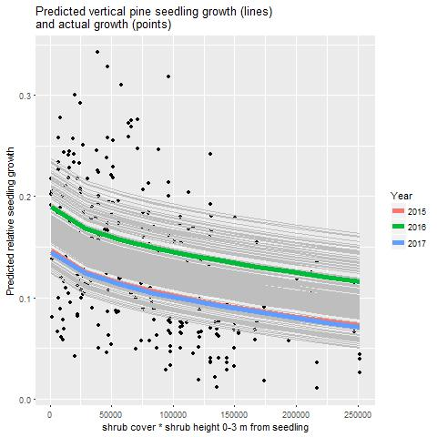

Shrubs-Seedlings README
================
Carmen
February 22, 2017

  - [Summary](#summary)
  - [Fire Footprint seedling growth in relation to shrubs (2016 and 2017
    data)](#fire-footprint-seedling-growth-in-relation-to-shrubs-2016-and-2017-data)
      - [Data processing](#data-processing)
      - [Analysis](#analysis)
      - [Next steps](#next-steps)

# Summary

This repository holds the code for analyzing Carmen’s summer 2016-2017
shrub and seedling measurements and other data related to the
interactions between shrubs and conifer seedlings. 

# Fire Footprint seedling growth in relation to shrubs (2016 and 2017 data)

## Data processing

  - cleaning and consolidating into one table is done in the files
    `clean_combine_2016-only.Rmd` and `clean_combine_2016-2017.Rmd`

## Analysis

Controlled variables:

  - Since this is a repeated measures analysis, **seedling** was
    included as a random effect in all models
  - **Fire** was also included as a random effect in all models
  - **Year** was included as a fixed effect for all models

To the above fixed and random effects, I tried all possible combinations
of the following variables:

2.  ShrG1: Most abundant shrub genus within 1 m from seedling
3.  IAG: Shrub genus immediately above seedling
4.  Cov1: Total cover of shrubs 0-1 m from seedling
5.  Cov1.2: Total cover of shrubs 0-2 m from seedling
6.  Cov1.3: Total cover of shrubs 0-3 m from seedling
7.  Ht1: Average shrub height 0-1 m from seedling
8.  Ht1.2: Average shrub height 0-2 m from seedling
9.  Ht1.3: Average shrub height 0-3 m from seedling
10. shrubarea1: Cov1\*Ht1, square root transformed
11. shrubarea2: Cov1.2\*Ht1.2, square root transformed
12. shrubarea3: Cov1.3\*Ht1.3, square root transformed
13. Seedling species
14. Slope/aspect
15. BasDia2017.mm.ave: Seedling diameter (average of the two
    measurements taken in 2017)
16. Ht\_cm: Seedling total height

And the following interactions:

1.  Ht\_cm \* Ht1.3
2.  Cov1.3 \* Ht1.3
3.  Species \* sqrt(shrubarea3)

<!-- end list -->

  - I excluded redundant combinations of variables/interactions (such as
    including Cov1 and Cov1.2 or including shrub cover, height, and
    cover\*height)
  - I calculated AIC for models with all of the possible variable and
    interaction combinations and found the model with the best AIC

The best model turned out to be:

``` r
lme(VertGrowth_Rel ~  Year + sqrt(shrubarea3), data = df, random = list(~ 1| Fire,~1| Sdlg))
```

For that model, and created a figure of predicted values for a fictional
set of data spanning the actual range of shrub measurements, and for all
fires and years:

<!--  -->


